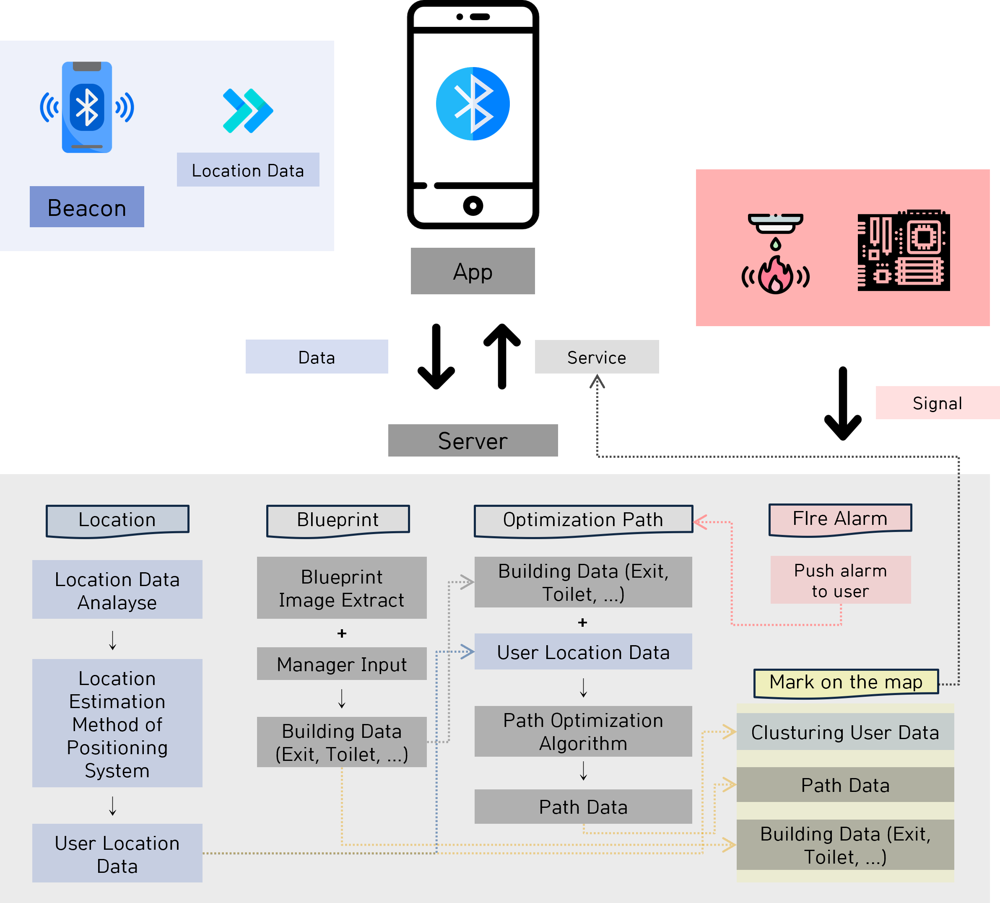
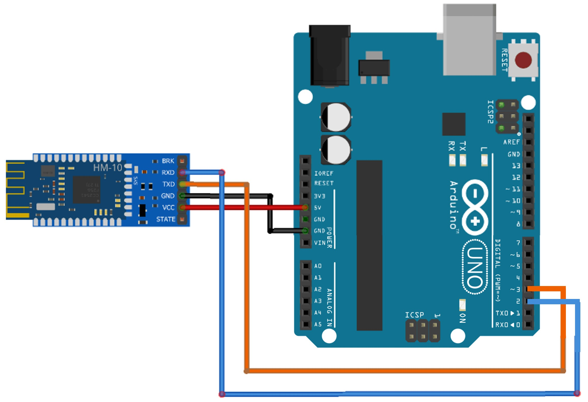
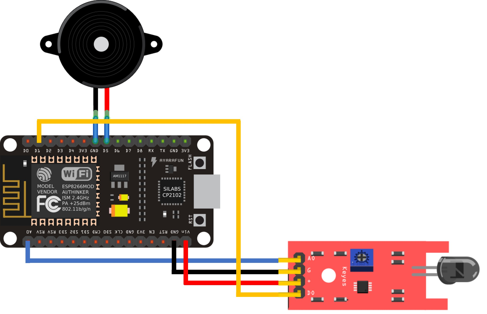

# ♚Mak-nae-on-Top

Development of an optimization route guide application for indoor fire evacuation using beacons

 

## 🗺️Table of Contents

- [Introduction](#Introduction)
- [Structure](#Structure)
- [Application](#Application)
  - Setup
  - Implementation
- [Algorithm](#Algorithm)
  - A\* algorithm
  - Setup
- [Server](#Server)
  - Setup
  - Trilaterration
- [IoT(Arduino)](#IoT)
  - Beacon
  - Fire detector
- [📌Contributors](#Contributors)

 

# 📝Introduction

Still, damage to fire accidents continues to occur. According to the U.S. Fire Administration, the average number of fire accidents from 2010 to 2019 was 1,300,000.
In detail, in 2019, 40.4% were externally occurring fires, 29.9% in residential spaces, 15.1% in vehicles, 9.4% in non-residential spaces, and 5.2% in other areas, and 39.3% of fires in buildings can be confirmed.
In order to prevent accidents involving indoor fires, this study was conducted by developing an app that informs the optimal route for indoor fire evacuation by using beacons.

 

> ### Purpose

    1. Use beacons to determine the exact location of the user in the building.

    2. Develop user-friendly application such as informing users of the beacon installation location by providing users with the ability to upload and modify building blueprints.

    3. Identify the density of people in the building and calculate the weight value to inform the optimal path.

> ### IEEE Paper

    

 
 

# 🍌Structure

> Application structure

 
 

# 🎙️Application

> #### 1. Setup

    사용한 툴과 코드 실행 방법

> #### 2. Implementation

 

- Sidebar

screen image

    짧은 설명과 코드 위치 링크로

 

- Beacon

screen image

    짧은 설명과 코드 위치 링크로

 

- Blueprint

screen image

    짧은 설명과 코드 위치 링크로

 
 

# 🍚Algorithm

real-time analysis A\* algorithm

> #### 1. A\* algorithm

result image

    formula
    description

> #### 2. Setup

    코드 위치 링크로
    사용한 툴과 코드 실행 방법

 
 

# 🌳Server

> #### 1. Setup

    코드 위치 링크로
    사용한 툴과 코드 실행 방법

> #### 2. Trilaterration

    What is Trilaterration
    코드 위치 링크로

 
 

# 📹IoT

> #### 1. Beacon

    description

> #### 2. Fire detector

    1. **Composition**

      1. NodeMCU
      2. Flame sensor
      3. Buzzer sensor
      4. 5-pin cable

    2. **Update Firmware**

      To use AT command, need to update the firmware to the latest version. Update is performed using ESP8266 Flasher without additional installation.

 
 

# 📌Contributors

| Name                                                                                                | Country           | Where to find you                       | Role      |
| --------------------------------------------------------------------------------------------------- | ----------------- | --------------------------------------- | --------- |
| Junseong Moon    | Republic Of Korea | [Github](https://github.com/gnoes)      | Paper     |
| Namho Kim        | Republic Of Korea | [Github](https://github.com/gitnamu)    | Backend   |
| Geonyeol Ryu     | Republic Of Korea | [Github](https://github.com/rjsduf0503) | Frontend  |
| Migyeong Kim     | Republic Of Korea | [Github](https://github.com/rmfosem613) | IoT       |
| Minsoo Sun       | Republic Of Korea | [Github](https://github.com/tjsalstn33) | Algorithm |

 
 

# LICENSE

    Copyright © (Mac-nae-on-top)

    Permission is hereby granted, free of charge, to any person obtaining a copy of this software and associated documentation files (the "Software"), to deal in the Software without restriction, including without limitation the rights to use, copy, modify, merge, publish, distribute, sublicense, and/or sell copies of the Software, and to permit persons to whom the Software is furnished to do so, subject to the following conditions:

    The above copyright notice and this permission notice shall be included in all copies or substantial portions of the Software.

    THE SOFTWARE IS PROVIDED "AS IS", WITHOUT WARRANTY OF ANY KIND, EXPRESS OR IMPLIED, INCLUDING BUT NOT LIMITED TO THE WARRANTIES OF MERCHANTABILITY, FITNESS FOR A PARTICULAR PURPOSE AND NONINFRINGEMENT. IN NO EVENT SHALL THE AUTHORS OR COPYRIGHT HOLDERS BE LIABLE FOR ANY CLAIM, DAMAGES OR OTHER LIABILITY, WHETHER IN AN ACTION OF CONTRACT, TORT OR OTHERWISE, ARISING FROM, OUT OF OR IN CONNECTION WITH THE SOFTWARE OR THE USE OR OTHER DEALINGS IN THE SOFTWARE.
